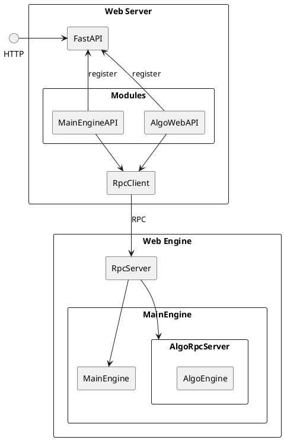

# MilkT-RPC

## Architecture

```plantuml
@startuml
skinparam componentStyle rectangle

component "Web Server" as web {
    [FastAPI]
    [RpcClient]
    component "Modules" as webmodules {
        [MainEngineAPI] -up-> [FastAPI]: register
        [AlgoWebAPI] -up-> [FastAPI]: register
        [MainEngineAPI] -down-> [RpcClient]
        [AlgoWebAPI] -down-> [RpcClient]
    }
}
HTTP -right-> [FastAPI]

component "Web Engine" as engine {
    [RpcServer]
    component "MainEngine" as mainengine {
        [RpcServer] -down-> [AlgoRpcServer]
        [RpcServer] -down-> [MainEngine]
    }

    component "AlgoRpcServer" {
        [AlgoEngine]
    }
}

[RpcClient] -down-> [RpcServer]: "RPC"
@enduml
```
